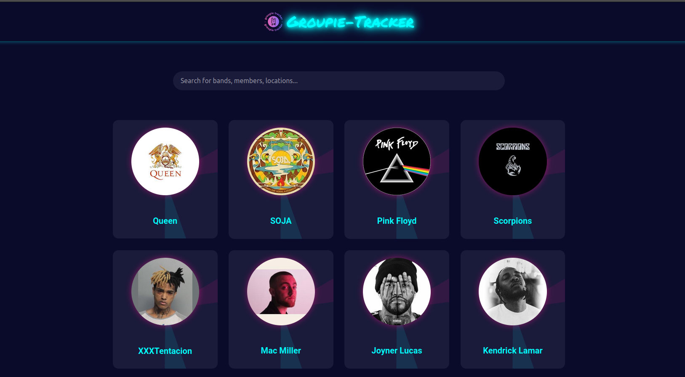
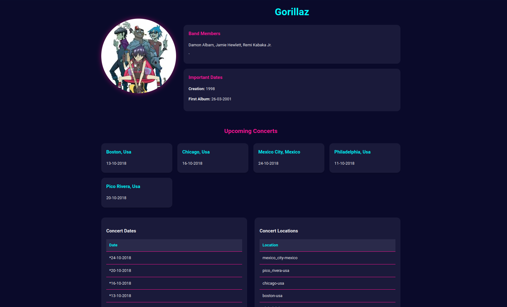
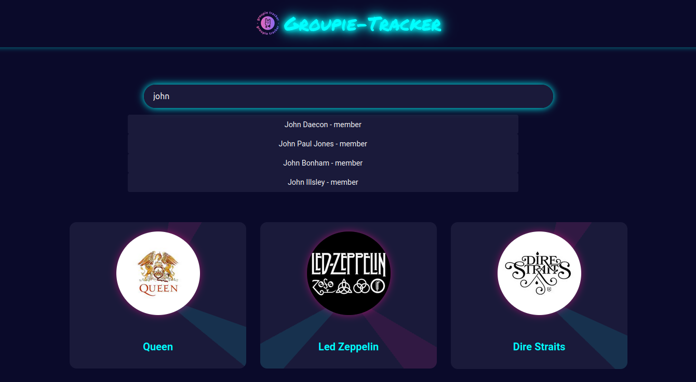
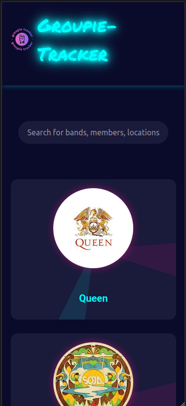

---

# Groupie Tracker Search Bar

## Project Overview

Groupie Tracker is a web application designed to display detailed information about music bands and artists using data from a given API. The project involves retrieving and manipulating data from the API, which contains information about artists, their concert locations, dates, and relations. The goal is to create a user-friendly website that visualizes this information through various data presentation methods like blocks, cards, tables, lists, pages, and graphics. Additionally, the project incorporates event-driven features that allow client-server communication, such as a robust **search bar** for quickly finding relevant artist details.



## Objectives

- **API Data Handling**: 
  - **Artists**: Information about bands and artists, including names, images, years of activity, first album dates, and members.
  - **Locations**: Information about the last and upcoming concert locations of the artists.
  - **Dates**: Information about the last and upcoming concert dates of the artists.
  - **Relations**: Links between artists, dates, and locations.



- **User-Friendly Website**: 
  - Visualize the information about bands and artists through various data visualization methods.
  - Create an intuitive and interactive user interface for easy navigation and data exploration.
  - Include a powerful search bar for quick lookups.

- **Client-Server Communication**: 
  - Implement a feature that triggers an action on the server based on client-side events.
  - Utilize the request-response model to handle communication between the client and server.

## Features

- **Data Visualization**: Display artist information using cards.
- **Dynamic Content**: Fetch and display real-time data from the API.
- **Search Bar with Real-Time Suggestions**:  
  The **search bar** is an interactive feature that allows users to quickly look up artists and related data within the application. As users type in the search box, the application matches the input against multiple fields, including:
  - **Artist/Band Name**
  - **Band Members**
  - **Concert Locations**
  - **First Album Date**
  - **Creation Date**

  The search is **case-insensitive** and displays real-time suggestions as the user types. Each suggestion is categorized to indicate the type of match (e.g., "Freddie Mercury - member" vs. "Queen - artist/band"). Once the user selects a suggestion or submits the query, the page dynamically updates to display the relevant details.



- **Event Handling**: Implement client-side events that trigger server-side actions, with proper request-response handling.
- **Error Handling**: Ensure the application handles errors gracefully and provides meaningful feedback to users.
- **Responsive Design**: The website is designed to be responsive and accessible on various devices.



## Project Structure

The project is organized into several packages:

- **`api`**: Handles API requests and data fetching.
  - Functions include `GetArtists`, `GetLocations`, `GetDates`, and `GetRelations`.

- **`models`**: Contains the data structures that represent the API data.
  - Structures include `Artist`, `Location`, `Date`, and `Relation`.

- **`routes`**: Manages the HTTP routes and handlers for serving the web pages and processing requests.
  - Functions include `ArtistsHandler`, `getArtistbyName`, and `ProfileHandler`.

- **`frontend`**: Contains the HTML templates, CSS, and other static assets for the website.


## Instructions

### Backend Implementations

- The backend is written in **Go**.
- All pages have been parsed correctly, and all errors are handled appropriately.
- **Unit tests** are provided to check for critical functions.

## Setup and Usage

### Prerequisites

- **Go**: Ensure you have Go installed on your machine. The required Go environment can be downloaded from [golang.org](https://golang.org/).

### Installation

1. **Clone the repository**:
   ```bash
   https://learn.zone01kisumu.ke/git/bnyatoro/groupie-tracker-search-bar
   cd groupie-tracker-search-bar
   ```

2. **Run the application**:
   ```bash
   go run main.go
   ```

3. **Access the website**:
   Open your web browser and go to `http://localhost:8000`.

### Running Tests

Unit tests are provided to ensure the correctness of the application. To run the tests, use the following command:

```bash
go test ./...
```

## What I Have Learned

This project has helped us to learn about:

- **Data Manipulation**: How to retrieve, process, and display data from an external API.
- **JSON Handling**: Working with JSON files and data structures in Go.
- **HTML & CSS**: Designing a user interface with HTML and CSS.
- **Event-Driven Programming**: Implementing and handling client-side events that trigger server-side actions (Example: Submitting a Search Form).
- **Client-Server Communication**: Understanding the request-response model in web applications (Example: Fetching Artist Details).
- **Search Implementation**: Building a dynamic, real-time search feature with suggestions that adapt to multiple data fields.
- **Error Handling**: Managing and responding to errors effectively (Example: Handling Invalid API Responses).

## Contributing

Contributions are welcome! Please fork the repository and submit a pull request with your changes. Ensure your code follows the best practices and includes tests for any new functionality.


## License

This project is licensed under the MIT License. See the [LICENSE](LICENSE) file for more information.

--- 
